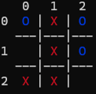
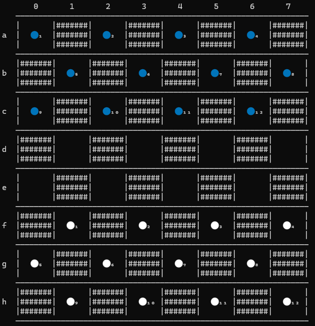
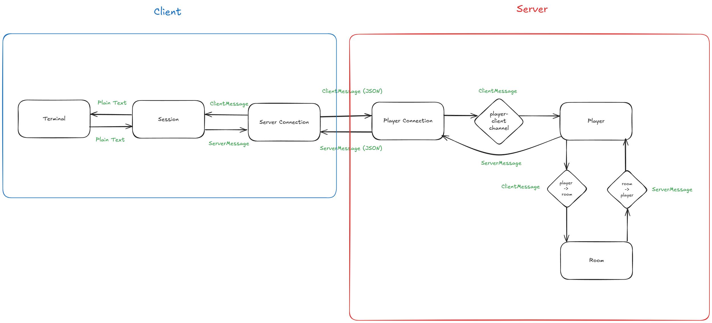

# ASCII Arcade

A multiplayer terminal-based arcade featuring classic board games, written in Go.

```
 █████╗ ███████╗ ██████╗██╗██╗     █████╗ ██████╗  ██████╗ █████╗ ██████╗ ███████╗
██╔══██╗██╔════╝██╔════╝██║██║    ██╔══██╗██╔══██╗██╔════╝██╔══██╗██╔══██╗██╔════╝
███████║███████╗██║     ██║██║    ███████║██████╔╝██║     ███████║██║  ██║█████╗  
██╔══██║╚════██║██║     ██║██║    ██╔══██║██╔══██╗██║     ██╔══██║██║  ██║██╔══╝  
██║  ██║███████║╚██████╗██║██║    ██║  ██║██║  ██║╚██████╗██║  ██║██████╔╝███████╗
╚═╝  ╚═╝╚══════╝ ╚═════╝╚═╝╚═╝    ╚═╝  ╚═╝╚═╝  ╚═╝ ╚═════╝╚═╝  ╚═╝╚═════╝ ╚══════╝
```
 
## Available Games

### TicTacToe


### Checkers


## Getting Started

### Prerequisites
- Go 1.24.4 or later
- Terminal with Unicode support

### Installation

1. **Download the latest release**:
   ```bash
   # Download from releases page or clone the repository
   git clone https://github.com/wbarthol/ascii-arcade-2.git
   cd ascii-arcade-2
   ```

2. **Build the client**:
   ```bash
   go build -o ascii-arcade .
   ```

3. **Run the game**:
   ```bash
   ./ascii-arcade
   ```

## Dataflow Design



## Planned Features
- [ ] **Singleplayer** vs. AI
- [ ] **Chess** implementation
