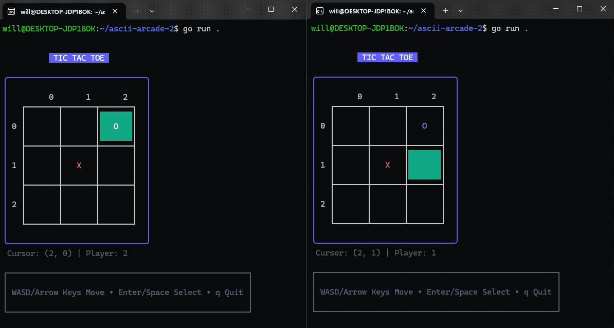
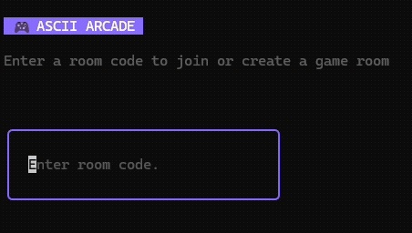
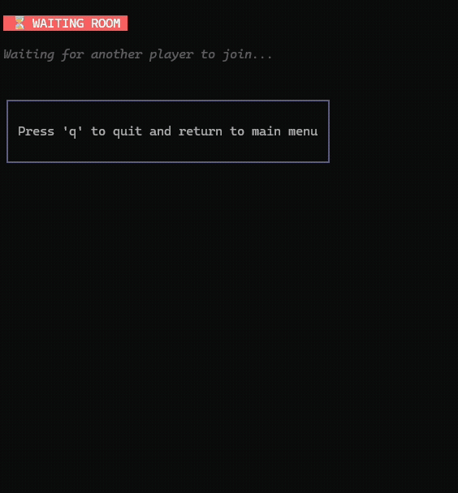

# ASCII ARCADE
Play your favorite board games with friends, right in your terminal!

## Motivation

ASCII Arcade was born from a love of classic board games and the elegance of terminal-based applications. In an age of complex GUIs and resource-heavy games, there's something refreshing about returning to the simplicity and accessibility of text-based interfaces. This project demonstrates that engaging, multiplayer gaming experiences don't require fancy graphics—just clever design, clean code, and a terminal.

## 🚀 Quick Start

### Download the executable: https://github.com/wbartholomay/ascii-arcade-2/blob/main/asciiarcade

## 📖 Usage

### Create a room

Enter a room code from the main menu, and share it with a friend!

### Select a game

Once another player joins your room, select a game. Have fun!

